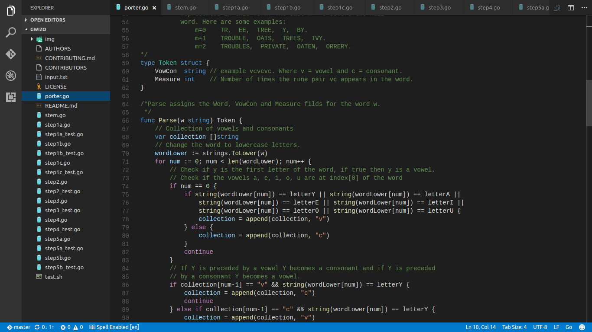

# Gwizo

Gwizo -- Go Wizard of Oz -- is a suite of open source Go packages, 
data sets and tutorials supporting research and development in Data science.

#### Porter
Package porter https://github.com/gwizo/porter implement Porter, M. "An algorithm for suffix stripping."
Program 14.3 (1980): 130-137.
Martin Porter, the algorithm's inventor, maintains a web page about the
algorithm at http://www.tartarus.org/~martin/PorterStemmer/